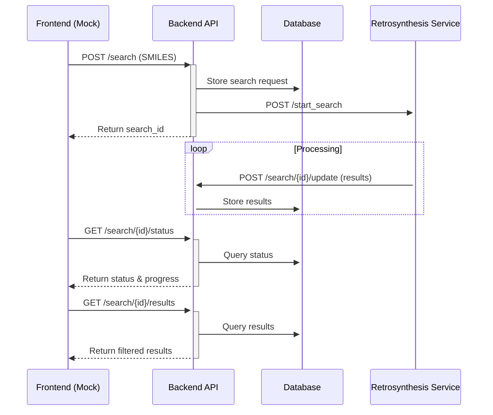

# Platform Engineering Take-Home Challenge

## Objective

Pretend you are inheriting this project and getting the repository ready for other engineers on your team. Build a fully local, runnable system for retrosynthesis search requests that demonstrates best practices and engineering excellence and is designed to be easily deployable to a cloud environment. To complete the challenge, please make a pull request in this repository.

**Time Expectation**: 2–4 hours to complete the take-home portion. Strong submissions will advance to a second technical round, which includes a live walkthrough of the candidate’s solution with team members and a systems design challenge (approximately 90 minutes).

**Note on AI Usage**: The use of AI tools is permitted for this challenge. Participants who choose to use AI (such as chatbots or agents) should be prepared to explain their strategy and prompting methodology when discussing their solution.

## System Overview

You will build a distributed system with the following components:



## What We Provide

- **API contracts** - Models and type definitions for backend/microservice communication
- **Business logic** - Core retrosynthesis functions (candidates will not be evaluated on their understanding of these functions)
- **Testing script** - A [script](scripts/mock_client.py) that simulates a frontend client to help verify your implementation
- **GitHub Action workflow** - A sample GitHub action workflow to run in CI

## What You Need to Build

### 1. Best Practices and Engineering Excellence

While correct implementations of (2) and (3) are required, evaluation focuses primarily on the overall quality of the repository as it would exist after the pull request is merged.

The work should be approached as an evolution of an early-stage prototype into something suitable for a mature technical stack maintained by a team and deployed to a cloud environment. Candidates are encouraged to be opinionated and to change anything they believe should be changed to demonstrate the skills, best practices, and engineering values they care about. Modifying the provided business logic code is unnecessary for this challenge; it may be assumed to be correct and treated as out of scope.

Evaluation emphasizes observability, developer experience, maintainability, and production readiness rather than performance or low-level implementation details.

### 2. Backend API Service

Implement a REST API with the following endpoints:

- `POST /api/search` - Submit a new retrosynthesis search
- `GET /api/search/{id}/status` - Poll for search status
- `GET /api/search/{id}/results` - Retrieve results with optional filters
- `POST /api/search/{id}/update` - Callback endpoint for microservice to post results

Use your choice of web framework and persistence layer. See [backend/README.md](backend/README.md) for details.

### 3. Retrosynthesis Microservice

Create a standalone service that:

- Accepts `POST /start_search` requests with SMILES string and callback URL
- Loads test data from `data/example_routes.json`
- Asynchronously posts results to the backend via the callback URL
- Simulates incremental processing by posting results in batches

Use your choice of web framework. See [microservice/README.md](microservice/README.md) for details.


## Cheminformatics Context (Optional, not required to complete the challenge)

### What is retrosynthesis?

At PostEra, one of our core technologies is automated
[retrosynthesis](https://en.wikipedia.org/wiki/Retrosynthetic_analysis), where
we combine ML with graph algorithms to find recipes for making complex
molecules from simpler, commercially available molecules. These recipes are
called "synthetic routes" or "routes", and there can be many such routes, with
varying starting available molecules, reactions, risk, and cost.

A retrosynthesis route is a directed bipartite graph of molecule nodes (M) and
reaction nodes (R). Edges going from a M1 node and into a R node represent
reaction pathways that produce the M1 molecule as a product, and edges going
from a R node and into a M2 node indicate that the M2 molecule is a reactant
for that reaction. For our purposes here, a reaction can accept multiple
reactants and produces exactly 1 product.

In this challenge, the example routes given are real route data from our [COVID
Moonshot](https://postera.ai/covid) drug discovery campaign.

### What is a "SMILES"?

Molecules are represented in code as [SMILES
strings](https://www.daylight.com/dayhtml_tutorials/languages/smiles/index.html).

Here's an example of the SMILES for [caffeine](https://en.wikipedia.org/wiki/Caffeine):

- `CN1C=NC2=C1C(=O)N(C(=O)N2C)C`

It is important to note that SMILES can be very sensitive information; this is the
IP of a drug, and often these are not disclosed until very late in the drug discovery
process.

## Quick Start

### Using Docker Compose (Recommended)

```bash
# Start all services
docker-compose up

# Services will be available at:
# - Backend API: http://localhost:8000
# - Microservice: http://localhost:8001
# - API Docs: http://localhost:8000/docs
```

### Local Development

See [SETUP.md](SETUP.md) for detailed setup instructions.

## Project Structure

- `backend/` - Backend API service (FastAPI + PostgreSQL + SQLAlchemy)
- `microservice/` - Retrosynthesis processing microservice (FastAPI)
- `scripts/` - Utility scripts including mock client for testing
- `docker-compose.yml` - Docker Compose configuration for local development

## Testing

Use the provided mock client to test the system:

```bash
cd scripts
python mock_client.py "CN1C=NC2=C1C(=O)N(C(=O)N2C)C"
```

## Technology Stack

- **Backend**: FastAPI, PostgreSQL, SQLAlchemy
- **Microservice**: FastAPI, AsyncIO
- **Containerization**: Docker, Docker Compose
- **Testing**: pytest, mock client script